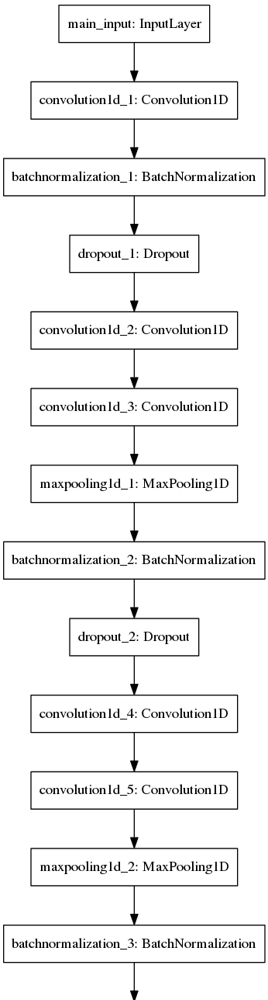

Character-level CNNs in NLP
========
This packages contains a Theano-based Keras implementation of a Deep Character-level Convolutional Network inspired by "Very Deep Convolutional Networks for Natural Language Processing" [Conneau et al. (2016)](https://arxiv.org/abs/1606.01781). Our Deep Character-level CNN implemenation is based on a model with 9 layers and uses max-pooling with kernel size 3 and stride 2. However, we add two modifications that make our network more efficient, which enables the network to achieve the same classificaiton accuracy as a 29 layer network.  

First, we move the Batchnormalization layer after the pooling layers, therefore successive convolutional layers are better able to capture nonlinearites. Second, we add a small amount of Dropout regularization immediatley after the Batchnormalization. The code is easily adaptable to the deeper models, following block convolutional methodology in [Conneau et al. (2016)]. 



Also this package contains the Keras implementation of "Character-level Convolutional Networks for Text
Classificationin" neural network model by [Zhang et al. (2015)](https://arxiv.org/abs/1509.01626) that is available at [Crepe](https://github.com/zhangxiangxiao/Crepe), which was originally written with Torch.

Download and Installation
-------

- Install [Theano](http://deeplearning.net/software/theano/install.html)
- Install [Keras](https://github.com/fchollet/keras#installation)
- Clone the repository
```
git clone https://github.com/sci-lab-uoit/cnn-nlp
```

Details
-------

To use the very deep CNN model [Conneau et al. (2016)](https://arxiv.org/abs/1606.01781), change deepFlag to 1 and to use the simpler CNN model [Zhang et al. (2015)](https://arxiv.org/abs/1509.01626),  set deepFlag to 0.

Please set the input data path to your directory.

To view the parser details.

```
python py-cdnn.py -h

Usage: py-cdnn.py [options]

Options:
  -h, --help            
  -f FLAG, --flag=FLAG  Theano Flags to indicate whether model is deep or not
  -m MAXLEN, --max=MAXLEN, --maxlen=MAXLEN
                        Specify the max length
  -e NUM_EPOCH, --epoch=NUM_EPOCH, --epochs=NUM_EPOCH
                        Specify the number of training iterations performed on
                        the network
  -b BATCH_SIZE, --batch=BATCH_SIZE, --batch_size=BATCH_SIZE
                        Specify the batch size for the model
  --z1=Z1, --z1_size=Z1
                        Specify the size of the first fully connected layer
  --z2=Z2, --z2_size=Z2
                        Specify the size of the second fully connected layer
  -p PATH, --path=PATH  Specify the project path

```

Running
-------

Then run the model using the following command:

```
python py-cdnn.py -f 1 -m 1300 -e 10 -b 64 --z1 2048 --z2 1024 -p /home/neil/projects/py-cdnn-text
```

Citation
--------

To cite Character-level CNNs in NLP for publications use:

Eren Gultepe, Neil Seward, and Masoud Makrehchi (2016). Character-level CNNs in NLP: A Python package for convolutaionl neural networks in natural language processing
